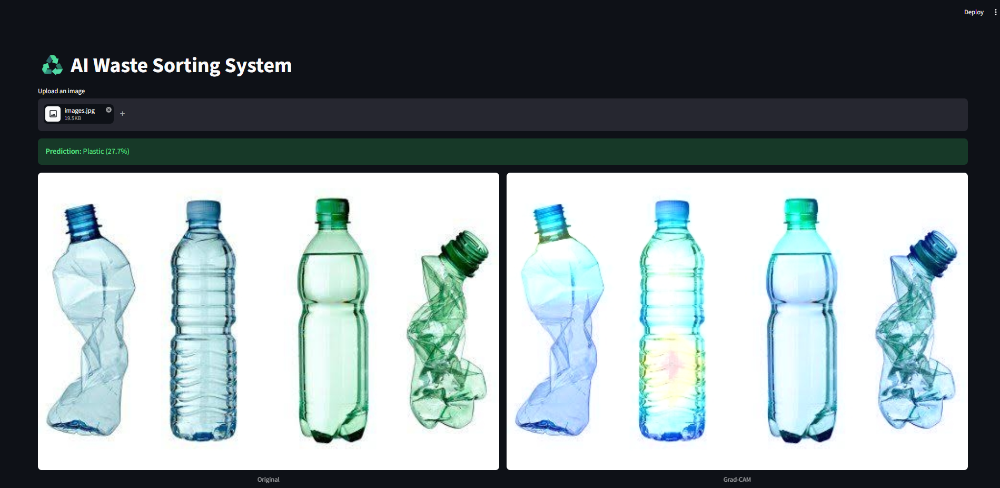

♻️ AI Waste Sorting System
A deep learning web application that classifies household waste into six categories and uses Explainable AI (XAI) to reveal how the model makes its decisions. Built with TensorFlow, OpenCV, and Streamlit.

This project demonstrates computer vision, transfer learning, and model interpretability (Grad-CAM), wrapped in a user-friendly frontend.

🌟 Features
Image Classification: Categorizes uploaded images into 6 classes: Cardboard, Glass, Metal, Paper, Plastic, and Trash.

Explainable AI (Grad-CAM): Generates a heatmap overlaid on the original image, highlighting the specific pixels and textures the AI focused on to make its prediction.

Transfer Learning: Utilizes a fine-tuned EfficientNetB0 model, leveraging pre-trained ImageNet weights for high accuracy on a lightweight architecture.

Interactive UI: Built entirely in Python using Streamlit for a seamless, responsive user experience.

🛠️ Tech Stack
Deep Learning Framework: TensorFlow / Keras

Base Architecture: EfficientNetB0

Computer Vision: OpenCV (cv2)

Web Framework: Streamlit

Data Manipulation: NumPy, Pillow (PIL)

📂 Dataset
This model was trained on the TrashNet Dataset, which contains 2,527 images of various waste items. The images were preprocessed, resized to 224x224, and split 80/20 for training and validation.

🚀 How to Run Locally
1. Clone the repository
Bash
git clone https://github.com/kelvinethom-eng/AI-waste-sorting-system.git
2. Set up a virtual environment
Windows:

DOS
python -m venv venv
venv\Scripts\activate
macOS/Linux:

Bash
python3 -m venv venv
source venv/bin/activate
3. Install dependencies
Bash
pip install tensorflow streamlit numpy opencv-python-headless pillow
4. Run the application
Bash
streamlit run app.py
The application will automatically open in your default web browser at http://localhost:8501.

🧠 How the Model Works
1. Transfer Learning Pipeline
Instead of training a convolutional neural network from scratch, this project uses EfficientNetB0 as a feature extractor. The base layers are frozen, and a custom classification head (Global Average Pooling → Dropout → Dense Softmax) is trained specifically on the TrashNet dataset.

2. Grad-CAM Interpretability
Gradient-weighted Class Activation Mapping (Grad-CAM) is implemented from scratch in gradcam.py. The algorithm calculates the gradient of the predicted class with respect to the feature maps of EfficientNet's final convolutional layer. This allows us to visually verify that the model is looking at the actual object rather than background noise.

📸 Screenshots
(Add a screenshot of your Streamlit app running side-by-side with the Grad-CAM visualization here)

Markdown

🤝 Future Improvements
Expand the dataset to include organic/compost waste.

Integrate a live webcam feed directly into the Streamlit app.

Deploy the model as an API endpoint using FastAPI.
